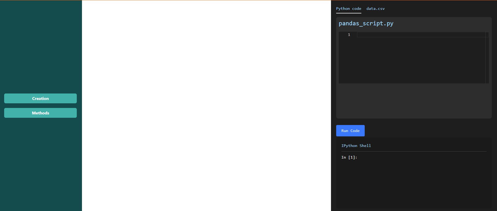
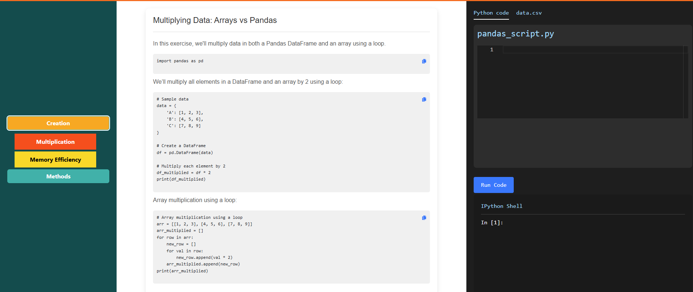
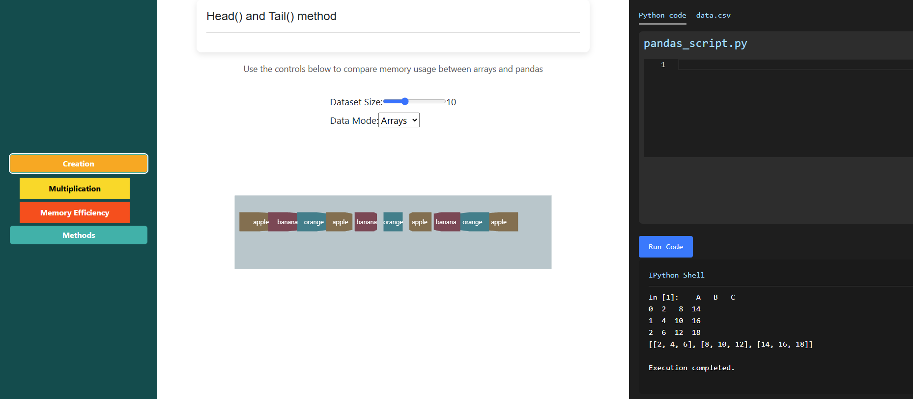
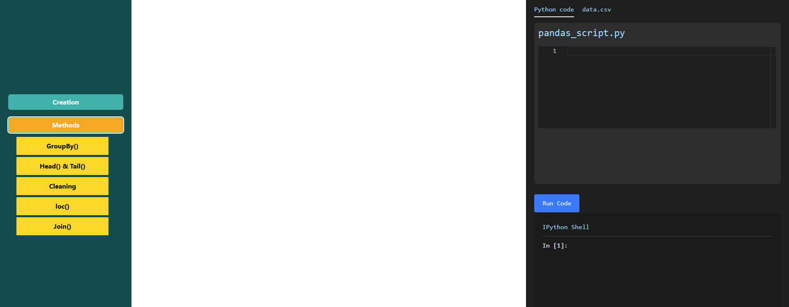
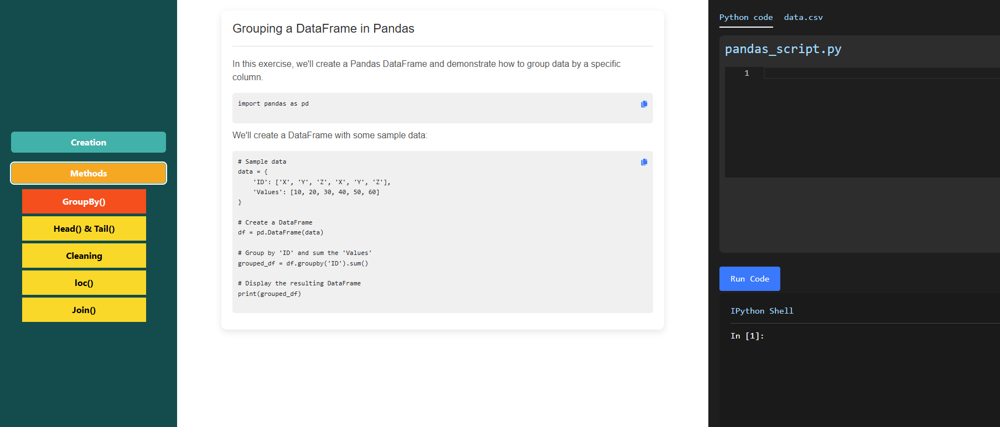
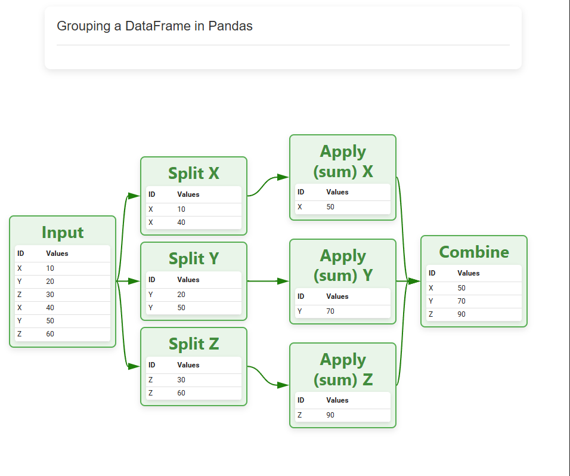

### Procedure

<strong>Step 1:</strong> Click the "Creation" button to explore the features of Pandas.

<strong>Step 2:</strong> Click the "Multiplication" button to explore Pandas multiplication. Copy the code and paste it into the code editor to observe the results.

<strong>Step 3:</strong> Click the <strong>Memory Efficiency</strong> button to compare the memory efficiency of Pandas and arrays.

<strong>Step 4:</strong> After completing the creation step, click the <strong>Methods</strong> button, then select the <strong>GroupBy</strong> button to explore this method.

<strong>Step 5:</strong> Copy the provided code, paste it into the code editor, and run it to observe the results.

<strong>Step 6:</strong> View the visual representation of the <strong>GroupBy</strong> method.

<strong>Step 7:</strong> Click on the remaining method buttons and explore each one in the same manner.

